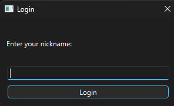
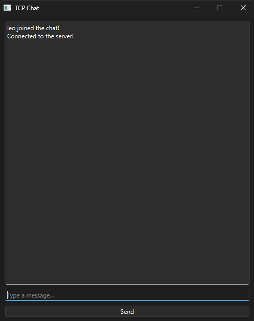

# TCP Chat

A modern desktop chat application built with **Python 3.14.3**, **PySide6**, and **TCP sockets**. The project was developed to practice network programming, client-server architecture, multithreading, and desktop application development while following a modular software structure.

Unlike a traditional command-line chat, TeamSulista provides a graphical user interface, allowing multiple clients to communicate in real time through a TCP server.

---

## Features

* Modern desktop interface built with **PySide6**
* Multi-client communication over TCP
* Nickname authentication before joining the chat
* Real-time message broadcasting
* Join and leave notifications
* Responsive GUI using background threads
* Modular project architecture
* Easy deployment with PyInstaller

---

## Project Structure

```text
TCPChat/
│
├── gui/
│   ├── chat_window.py      # Main chat interface
│   └── login_dialog.py     # Login dialog
│
├── network/
│   ├── __init__.py         
│   └── client_socket.py    # TCP client communication
│
├── server/
│   └── server.py           # TCP server
│
├── main.py                 # Application entry point             
├── requirements.txt
└── README.md
```

---

## Technologies

* Python 3.14.3
* PySide6 (Qt for Python)
* TCP/IP
* Socket Programming
* Multithreading

---

## Concepts Practiced

This project focuses on fundamental networking and software engineering concepts, including:

* TCP socket programming
* Client-server architecture
* IPv4 networking
* Concurrent programming with threads
* Event-driven GUI development
* Separation of concerns
* Modular application design
* Real-time communication
* Connection management
* Desktop application development

---

## How It Works

### Server

The server is responsible for managing all client connections.

It performs the following tasks:

1. Creates a TCP socket.
2. Binds to the configured IP address and port.
3. Waits for incoming client connections.
4. Requests the client's nickname.
5. Stores connected clients.
6. Broadcasts incoming messages to every connected client.
7. Removes disconnected users automatically.

---

### Client

The client application provides a graphical interface for chatting.

When launched, it:

1. Opens a login dialog.
2. Connects to the TCP server.
3. Sends the user's nickname.
4. Opens the main chat window.
5. Starts a background thread to receive incoming messages.
6. Allows users to send messages without blocking the interface.

---

## Installation

Clone the repository:

```bash
git clone https://github.com/leonardoteles31/TCPChat.git
```

Navigate to the project directory:

```bash
cd TCPChat
```

Install the dependencies:

```bash
pip install -r requirements.txt
```

---

## Running the Application

### Start the server

```bash
python server.py
```

Example output:

```text
Server is online!
Listening for incoming connections...
```

---

### Start the client

```bash
python main.py
```

Enter your nickname in the login window and connect to the server.

To simulate multiple users, simply launch additional client instances.

---

## Example

### Server

```text
Server is online!
Connected with ('xxx.xxx.x.xx', xxxxx)
Nickname of the client is Leonardo
```

### Client

```text
Leonardo joined the chat!

Alice:
Hello everyone!

Leonardo:
Welcome to Chat!
```

---

## Screenshots

### Login Window

> 

### Chat Window

> 

---

## Learning Objectives

This project was created to improve practical knowledge in:

* Network Programming
* Python Sockets
* TCP/IP Communication
* PySide6 (Qt for Python)
* Multithreading
* Client-Server Systems
* Software Architecture
* Desktop GUI Development
* Event-driven Programming

---

## License

This project is licensed under the **MIT License**.

Feel free to use, modify, and distribute this project for educational and personal purposes.
